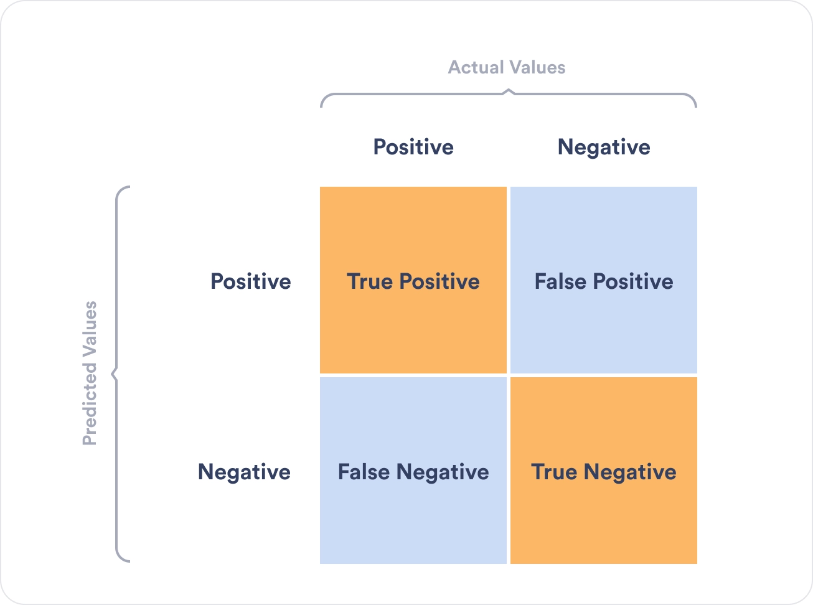

# Scikit-Learn

## Conteúdos
- [Introdução ao Scikit-Learn](#descrição)
- [Paradigmas de Aprendizado de Máquina](#os-3-paradigmas-machine-learn)
- [Tipos de Modelos](#tipos-de-modelo)
- [Classes e Desbalanceamento](#tipos-de-classes)
- [Recursos do Scikit-Learn](#recursos-do-scikit-learn)
- [Métricas de Avaliação](#métricas)
## Descrição 

### O que é o Scikit-Learn?

Scikit-learn é uma biblioteca de aprendizado de máquina de código aberto amplamente utilizada na linguagem de programação Python. Famosa por sua simplicidade e eficácia, é uma das ferramentas mais populares para análise de dados e modelagem estatística.

# Definições
## Os 3 Paradigmas Machine Learn

### Aprendizado Supervisionado (Supervised Learning - SL)
Mais conhecido como Supervised Learning (SL)
No aprendizado supervisionado, o modelo é treinado com um conjunto de dados rotulado. Isso significa que cada exemplo no conjunto de treinamento é composto por um par de entrada (como uma imagem ou um conjunto de características) e a saída correspondente, ou rótulo (como uma etiqueta ou valor). O objetivo é aprender um mapeamento dos dados de entrada para a saída, de modo que o modelo possa prever a saída para novos exemplos de entrada. Esse tipo de aprendizado é amplamente utilizado para tarefas como classificação (por exemplo, distinguir entre imagens de gatos e cachorros) e regressão (por exemplo, prever preços de casas com base em características).

### Aprendizado não Supervisionado (Unsupervised Learning - UL)
O aprendizado não supervisionado envolve o treinamento de modelos em conjuntos de dados onde as saídas ou rótulos não são fornecidos. O objetivo é descobrir padrões ocultos, agrupamentos ou estruturas nos dados. Os algoritmos de aprendizado não supervisionado tentam modelar a estrutura ou distribuição subjacente dos dados a fim de aprender mais sobre os dados. Exemplos comuns incluem agrupamento (por exemplo, agrupar clientes com base em comportamentos de compra) e redução de dimensionalidade (por exemplo, simplificar dados de alta dimensão para facilitar a visualização).

### Aprendizado por Reforço (Reinforcement Learning - RL)
No aprendizado por reforço, um agente aprende a tomar decisões por meio de um processo de tentativa e erro. O agente interage com um ambiente e recebe recompensas ou penalidades com base nas ações que executa. O objetivo é aprender uma política de ações que maximize a soma de recompensas ao longo do tempo. Este tipo de aprendizado é particularmente útil para tarefas que requerem uma sequência de decisões, como jogos, navegação de robôs, ou otimização de sistemas. O aprendizado por reforço difere do aprendizado supervisionado e não supervisionado porque o agente aprende com as consequências de suas ações, ao invés de ser ensinado explicitamente com dados rotulados ou não rotulados.

## Tipos de Modelo c/ Aprendizado Supervisionado

### Regressão Linear
A regressão linear é um método estatístico utilizado para modelar a relação entre uma variável dependente (ou resposta) e uma ou mais variáveis independentes (ou preditoras). O objetivo é encontrar uma equação linear que represente a relação entre essas variáveis da melhor maneira possível.

[Imagem retirada do site analise macro](https://analisemacro.com.br/econometria-e-machine-learning/regressao-linear-teoria-e-pratica/)

Como podemos perceber pela imagem temos basicamente que a regressão linear simples faz uma reta tentando minimizar a distância entre todos os pontos. Sua forma algébrica é dada na forma: 

$$
y = \beta_0 + \beta_1 x + \epsilon
$$

onde:
- $\beta_0$ é o intercepto .
- $\beta_1$ é o coeficiente angular.
- $\epsilon$ é o termo de erro.
- $x$ é a variável independente.
- $y$ é a variável dependente.

Existe a regressão múltipla que consiste em uma sequência de $\beta_n x_n$ influênciando no $y$.

**Premissas:**

Esta parte do [texto foi retirada do site analise macro](https://analisemacro.com.br/econometria-e-machine-learning/regressao-linear-teoria-e-pratica/)

"
Quando usamos o modelo de regressão linear, implicitamente assumimos algumas premissas sobre a equação anterior. Aqui vamos destacar algumas delas:

**-Primeiro**, assumimos que o modelo é uma aproximação razoável da realidade, ou seja, a relação entre a variável dependente e as variáveis independentes satisfazem essa equação linear.

**-Segundo**, assumimos as seguintes premissas sobre o termo de erro e da regressão:

Erros têm média zero, caso contrário, os valores previstos de y serão sistematicamente tendenciosos;
Erros não são autocorrelacionados, caso contrário, as previsões serão ineficientes, pois haveria mais informações nos dados que poderiam ser exploradas;
Erros não têm relação com as variáveis independentes, caso contrário, haveria mais informações que deveriam ser incluídas na parte sistemática do modelo.
Também é útil ter os erros distribuídos normalmente com uma variância constante para produzir intervalos de previsão. Vale pontuar que as premissas podem variar conforme o método de estimação dos coeficientes."

### Regressão Logística
O objetivo da regressão Logística é estimar a probabilidade associada a ocorrência de determinado evento. Logo os valores vão variar entre 0% à 100%. O modelo de regressão logísca tem a seguinte forma: 

$$
P(Y=1) = \frac{1}{1+ e^{-g(x)}}
$$

onde:
- $P$ é probabilidade do evento .
- $g(x) = \beta_0 + \beta_1 x_1 + ... + \beta_n x_n$.

Os estimadores $\beta_i$ são dados pelo método da máxima verossimilhança. 

[Imagem retirado de um material da USP](https://edisciplinas.usp.br/pluginfile.php/3769787/mod_resource/content/1/09_RegressaoLogistica.pdf)

Para tirarmos uma conclusão desde modelo normalmente é separado da seguinte forma 

- Se $P(Y=1)> 0.5$ então classifica-se Y=1
- Se $P(Y=1)< 0.5$ então classifica-se Y=0

O valor de 0.5 é o 'default', podemos altera-lo caso faça sentido para o nosso modelo.

Para avaliar nosso modelo podemos utilizar o teste de Wald. Ele avalia o grau de significância de cada coeficiente $\beta_i.$

### Árvores de Decisão

A árvore de decisão é um modelo de aprendizado de máquina que pode ser utilizado tanto para problemas de regressão quanto para problemas de classificação. Ela é construída de forma hierárquica, onde o conjunto de dados é dividido em subconjuntos com base em condições específicas, levando a decisões ou previsões.

A seguir, apresento uma descrição mais detalhada das terminologias associadas à árvore de decisão:

Root Node (Nó Raiz): O nó inicial no início de uma árvore de decisão, onde toda a população ou conjunto de dados começa a ser dividido com base em diferentes características ou condições.

Decision Nodes (Nós de Decisão): Nós resultantes da divisão dos nós raiz, conhecidos como nós de decisão. Esses nós representam decisões intermediárias ou condições dentro da árvore.

Leaf Nodes (Nós Folha): Nós onde não é possível realizar mais divisões, indicando frequentemente a classificação final ou resultado. Também são chamados de nós terminais.

Sub-Tree (Sub-Árvore): Semelhante a uma subseção de um gráfico sendo chamada de sub-gráfico, uma subseção de uma árvore de decisão é referida como sub-árvore. Ela representa uma porção específica da árvore de decisão.

Pruning (Poda): O processo de remoção ou corte de nós específicos em uma árvore de decisão para evitar overfitting (ajuste excessivo) e simplificar o modelo.

Branch / Sub-Tree (Ramo / Sub-Árvore): Uma subseção da árvore de decisão completa é referida como um ramo ou sub-árvore. Ela representa um caminho específico de decisões e resultados dentro da árvore.

Parent and Child Node (Nó Pai e Nó Filho): Em uma árvore de decisão, um nó que é dividido em sub-nós é conhecido como nó pai, e os sub-nós que surgem dele são chamados de nós filhos. O nó pai representa uma decisão ou condição, enquanto os nós filhos representam os resultados potenciais ou decisões subsequentes com base nessa condição.

Imagem retirada do site [analyticsvidhya](https://www.analyticsvidhya.com/blog/2021/08/decision-tree-algorithm/#:~:text=A%20decision%20tree%20algorithm%20is,each%20node%20of%20the%20tree.).

A árvore de decisão busca fazer as melhores perguntas para dividir os dados de maneira eficaz e chegar a decisões ou previsões precisas. No entanto, é interessante notar que em alguns casos, perguntas aparentemente aleatórias podem ser mais eficazes para resolver certos tipos de problemas, o que destaca a versatilidade desse modelo em explorar diferentes caminhos de decisão.

Uma fonte que pode ser utilizada de referência que explica detalhamente este modelo e está em português é: [Edisciplinas USP](https://edisciplinas.usp.br/pluginfile.php/4469825/mod_resource/content/1/ArvoresDecisao_normalsize.pdf).

### Random Forest

O Random Forest (Floresta Aleatória) é um poderoso algoritmo de aprendizado de máquina que pertence à categoria de métodos de ensemble. Ensemble refere-se à técnica de combinar vários modelos para obter um desempenho melhor do que o de cada modelo individual. Random Forest é particularmente eficaz para problemas de classificação e regressão.

O ensacamento, também conhecido como Bootstrap Aggregating, é uma técnica utilizada pelo Random Forest para criar múltiplas árvores de decisão diferentes. Esse processo envolve a criação de várias amostras de treinamento com reposição a partir do conjunto de dados original, sendo cada amostra usada para treinar uma árvore de decisão.

Durante a construção de cada árvore, o algoritmo Random Forest introduz subconjuntos aleatórios de atributos. Em cada nó de decisão, um subconjunto de atributos é selecionado aleatoriamente. Essa aleatoriedade contribui para garantir a diversidade entre as árvores, evitando que um único atributo dominante influencie demasiadamente o modelo.

Quanto às previsões, no caso de classificação, as árvores votam e a previsão final é determinada pelo voto majoritário. Para problemas de regressão, as previsões são geralmente médias.

O Random Forest apresenta diversas vantagens, incluindo robustez para lidar com dados ausentes e outliers, alta precisão em comparação com uma única árvore de decisão, e capacidade de lidar com overfitting, graças à aleatoriedade na seleção de atributos e ensacamento.

Porém, algumas desvantagens também são observadas, como a complexidade computacional, já que treinar várias árvores pode ser intensivo em termos de recursos, e a menor interpretabilidade em comparação com uma única árvore de decisão.

O Random Forest encontra aplicações em diversas áreas, como diagnóstico médico, detecção de fraudes, previsão de churn em clientes, reconhecimento de padrões, entre outras. Sua versatilidade e eficácia o tornam uma escolha popular para uma variedade de problemas de aprendizado de máquina.

### Máquinas de Vetores de Suporte (SVM)
É um algoritmo de ML utilizado tanto para classificação quanto para regressão. O principal objetivo das SVMs é encontrar o hiperplano de decisão que melhor separa as classes em um espaço de alta dimensão. Elas são particularmente eficazes em espaços de características complexos, nos quais as fronteiras de decisão não 
são lineares.

**Alguns dos hiperparâmetros utilizados no SVM são:** 

- Kernel (Tipo de Kernel):

O kernel determina a função matemática usada para transformar os dados originais em um espaço de características de maior dimensão. Os kernels comuns incluem o linear, polinomial e radial (ou gaussiano). A escolha do kernel depende da natureza dos dados e da complexidade da relação entre as classes.

- Custo (C):

O parâmetro C controla o equilíbrio entre alcançar uma margem mais ampla e classificar corretamente os pontos de treinamento. Um valor grande de C implica uma penalidade mais severa por classificações incorretas, o que pode levar a uma margem menor, mas uma classificação mais precisa dos dados de treinamento.

- Parâmetro do Kernel (Gamma):

Especificamente para kernels polinomiais e radiais, o parâmetro gamma (γ) controla a influência de uma única amostra de treinamento, afetando a forma da superfície de decisão. Valores baixos de gamma indicam uma influência mais ampla, enquanto valores altos indicam uma influência mais restrita.

- Margem (epsilon):

Em problemas de regressão com SVM, você pode ter um hiperparâmetro epsilon que controla a largura da faixa de suporte, que é a margem permitida para os pontos de treinamento fora da faixa de suporte.

**Algumas vantagens:** 

- Bom Desempenho em Problemas de Classificação Binária:

SVM é particularmente poderoso em problemas de classificação binária, onde a separação linear ou não linear é crucial.

- Regularização Incorporada:

A função de custo C atua como um parâmetro de regularização incorporado, controlando a flexibilidade do modelo e ajudando a evitar overfitting.

- Manuseio Eficiente de Espaços Não Lineares:

Através do uso de kernels, o SVM pode lidar eficientemente com problemas não lineares, mapeando os dados para espaços de características mais complexos.

**Algumas desvantagens:**

- Complexidade Computacional:

O treinamento de SVMs pode ser computacionalmente intensivo, especialmente em conjuntos de dados muito grandes.

- Escolha de Parâmetros:

A escolha adequada de parâmetros, como o tipo de kernel e os valores de C e gamma, pode ser desafiadora e influenciar significativamente o desempenho.

- Interpretabilidade Limitada:

Os resultados gerados por SVM podem ser difíceis de interpretar, especialmente em espaços de características de alta dimensão.

### Redes Neurais Artificiais

## Tipos de Modelo c/ Aprendizado não Supervisionado

### K-Means
### Análise de Componentes Principais (PCA):
### Agrupamento Hierárquico:
### DBSCAN

## Tipos de Modelo c/ Aprendizado por Reforço

### Q-Learning
### Política de Gradiente
### Deep Q-Network (DQN)
### Aprendizado por Reforço Profundo

## Tipos de Classes

### Classe Balanceada

### Classe Desbalanceada

## Tipos de variável

### Variável dependente 
categorica

### Variável independente

# Recursos do Scikit-Learn

## StandardScaler 

StandardScaler é uma ferramenta do Scikit-learn usada para pré-processar dados antes de aplicar algoritmos de aprendizado de máquina. Seu principal objetivo é padronizar os recursos (colunas) dos dados, garantindo que eles tenham média 0 e variância 1. 

Isso é especialmente importante para algoritmos que são sensíveis à escala dos dados, como K-Nearest Neighbors (KNN) e Support Vector Machines (SVM). A padronização é realizada subtraindo a média de cada recurso e depois dividindo pelo desvio padrão dos recursos. Matematicamente, para um recurso 
X, a padronização é dada por:

$$
Z = \frac{X - \mu}{\sigma}
$$

onde:
- `Z` é o valor padronizado.
- `X` é o valor original.
- $`\mu`$ é a média dos valores de `X`.
- $`\sigma`$ é o desvio padrão dos valores de `X`.

# Métricas

## Conteúdos
- [Acurácia](#acurácia)
- [Precisão](#precisão)
- [Recall (Sensibilidade)](#recall-sensibilidade)
- [F1-Score](#f1-score)
- [Matriz de Confusão](#matriz-de-confusão)
- [ROC-AUC](#roc-auc)

## Classificação: 

### Acurácia 
A Acurácia é calculada com 

$$
Acurácia = \frac{Predicões \ Corretas}{Predicões \ Totais}
$$

Portanto, ela responde a pergunta de "o quanto esse modelo acerta?" ou "qual a % de acerto".

###  Precisão 
Para explicar o que é precisão é preciso explicar primeiramente o que é  Verdadeiro Positivo (True Positive) e Falso Positivo (False Positive). Para facilitar irei tomar o termo em inglês. Que pode ser compreendido com a imagem: 

A imagem foi retirada do site "https://plat.ai/blog/confusion-matrix-in-machine-learning/".

Para calcular a precisão podemos utilizar 

$$
Precisão = \frac{T_p}{T_p + F_p}
$$

- $T_p$ é True Positive.
- $F_p$ é False Positive.

Aumentar a precisão em alguns tipos de modelo é essencial, por exemplo, para modelos de Diagnóstico Médico, Sistemas de Justiça Criminal e Detecção de Fraude são alguns dos modelos que a precisão faz um papel essencial.

### Recall Sensibilidade
O Recall é calculado da seguinte forma: 

$$
Recall = \frac{T_p}{T_p + F_n}
$$

- $T_p$ é True Positive.
- $F_n$ é False Negative.

A importância do recall geralmente se baseia em uma análise de risco e custo associada a falsos negativos.  Em muitos casos, existe um trade-off entre recall e precisão. Melhorar o recall muitas vezes significa aceitar mais falsos positivos.

Em resumo, o recall é uma métrica importante em cenários onde as consequências de não detectar um evento positivo (falso negativo) são mais graves do que detectar erroneamente um evento que não ocorreu (falso positivo).

###  F1-Score 
O F1 Score é a média harmônica entre precisão e recall, oferecendo uma única medida que leva em conta tanto a capacidade do modelo de identificar corretamente os casos positivos (recall) quanto a sua precisão em não classificar incorretamente os casos negativos como positivos. Ele é definido da seguinte forma:

$$
F_1 = 2*\frac{P \ \times R}{P \ + R}
$$

- $P$ é Precisão.
- $R$ é Recall.

Com um único número representando tanto a precisão quanto o recall, o F1 Score facilita a comparação entre diferentes modelos ou abordagens, ajudando na escolha do modelo mais adequado para um problema específico.

###  Matriz de Confusão 
 A matriz de confusão é uma tabela que permite a visualização do desempenho do algoritmo, mostrando a comparação entre os valores reais (verdadeiros) e os valores previstos pelo modelo. Para casos binarios, verdadeiro ou falso podemos entender a matriz de confusão como o calculo de  $\ T_p, \ T_n, \ F_p,\  F_n$. 

Temos também a Aplicação em Classificação Multiclasse, em problemas de classificação multiclasse, a matriz de confusão se expande para acomodar todas as classes. Neste caso, ela tem dimensões n x n, onde n é o número de classes. Cada linha representa as instâncias de uma classe real, e cada coluna representa as instâncias de uma classe prevista.

Em resumo, a matriz de confusão é uma ferramenta essencial para a análise profunda do desempenho de modelos de classificação, fornecendo informações valiosas para aprimorar a precisão do modelo.

###  ROC-AUC
ROC-AUC é uma métrica usada para avaliar o desempenho de modelos de classificação, especialmente em contextos onde as classes são desbalanceadas. ROC significa "Receiver Operating Characteristic" e AUC é a "Area Under the Curve" (Área Sob a Curva). Juntas, essas duas medidas fornecem uma visão abrangente de quão bem um modelo de classificação pode distinguir entre as diferentes classes.

Entendendo a Curva ROC:
Curva ROC: É um gráfico que representa a relação entre a taxa de verdadeiros positivos (sensibilidade ou recall) e a taxa de falsos positivos para diferentes limiares de classificação.

Eixo X (Taxa de Falsos Positivos): Representa a proporção de negativos reais que foram incorretamente classificados como positivos.
Eixo Y (Taxa de Verdadeiros Positivos): Representa a proporção de positivos reais que foram corretamente identificados.
Pontos na Curva: Cada ponto na curva ROC representa um limiar de decisão específico. Um modelo que faz previsões aleatórias terá uma curva ROC que é uma linha diagonal do canto inferior esquerdo para o canto superior direito do gráfico. Modelos com melhor desempenho têm curvas ROC que se inclinam para o canto superior esquerdo.

Entendendo AUC (Área Sob a Curva):
AUC: Mede toda a área bidimensional sob a curva ROC.
AUC = 1: Representa um modelo perfeito que consegue distinguir perfeitamente entre todas as classes positivas e negativas.
0.5 ≤ AUC < 1: Quanto maior o AUC, melhor o modelo é em distinguir entre as classes. Um modelo com AUC de 0.5 não tem capacidade de classificação melhor do que o acaso.
AUC < 0.5: Sugere que o modelo está fazendo pior do que classificações aleatórias.

Ao contrário de outras métricas como precisão e recall, o ROC-AUC fornece uma medida de desempenho que é independente de um limiar de classificação específico. O ROC-AUC é uma ferramenta poderosa na avaliação de modelos de classificação, particularmente útil em situações com desbalanceamento de classes ou quando a escolha de um limiar de decisão específico não é clara. Ele oferece uma visão mais holística do desempenho do modelo em comparação a métricas que dependem de um limiar específico, como precisão e recall.

